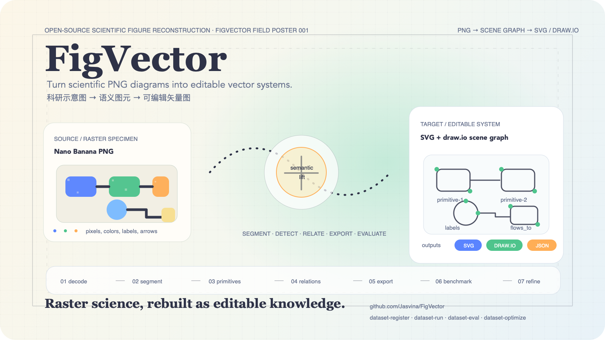
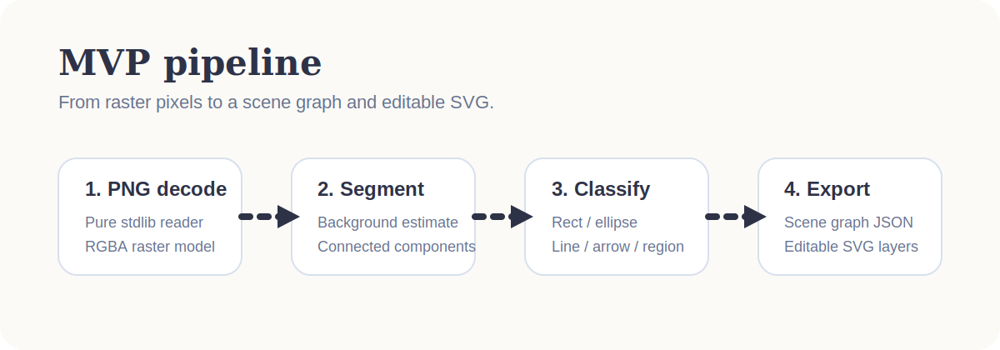
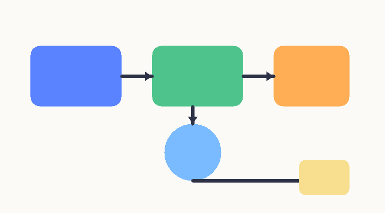
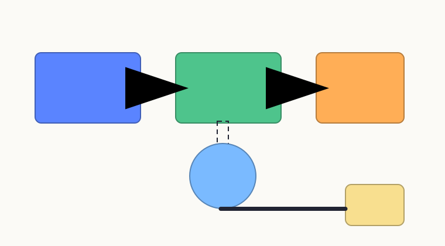
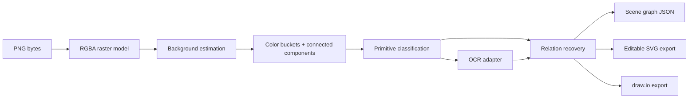

# FigVector

> Turn clean scientific PNG diagrams into editable vector graphics.
>
> 把干净的科研示意图 PNG 重建为可编辑的矢量图（首版聚焦 SVG）。



<p align="center">
  <sub>Poster source: <code>docs/assets/figvector-poster.svg</code> · Design philosophy: <code>docs/design/figvector-poster-philosophy.md</code></sub>
</p>

## Project status

For the current implementation status, verification notes, and future optimization plan, see [`docs/PROJECT_STATUS.md`](docs/PROJECT_STATUS.md).

## Why FigVector

科研工作流里最痛的一件事，是图已经生成出来了，但后续又要改：

- 想换箭头、改配色、调布局、补一个模块；
- 只有一张 `PNG`，却没有源文件；
- 传统的 trace bitmap 只能描边，不能恢复图中的 **对象语义**；
- 真正需要的是一个能把科研图重新拆成 **框、圆、箭头、连线、文本、图层** 的工具。

**FigVector** 的目标不是做一个普通的位图描边器，而是做一个面向科研示意图的 **semantic vector reconstruction** 项目：

`PNG -> scene graph -> editable SVG / draw.io / future design-tool exports`

## What the repository already does

当前仓库已经完成了一个 **stdlib-only MVP bootstrap**：

- 纯 Python 3.11、零第三方依赖的 PNG 读取器；
- 基于背景估计 + 颜色量化 + 连通域的基础分割；
- 对干净图元做首版分类：`rectangle` / `ellipse` / `line` / `arrow` / `polyline` / `region`；
- 把检测结果导出成可编辑 `SVG`；
- 导出 `draw.io` XML，方便继续在 diagrams.net 里编辑；
- 对箭头/连线做首版关系恢复，推断 `connects_from` / `connects_to`；
- 提供可插拔 OCR adapter，当前支持 `none` / `sidecar-json` / `tesseract-cli`；
- 提供真实 `Nano Banana` PNG 样例集脚手架，方便把 repo 从 synthetic demo 推向真实评测；
- 支持 lightweight dataset evaluation，可用 `expected` 规则检查 primitive / relation / text 是否大致命中；
- 支持 `dataset-register` / `dataset-optimize`，把真实样例 intake、profile sweep 和误差摘要放进同一条工作流；
- 支持 `dataset-bootstrap-expected`，可以从已有 report 自动生成 benchmark 模板；
- 额外导出结构化 `JSON report`，为后续更强的 scene graph 打底；
- 生成一套可复现的 demo 输入/输出，方便我们持续迭代。

这不是最终算法，但它已经把仓库从“想法”推进到了“可运行的最小原型”。

## Project preview



### Synthetic demo

| Input PNG | Output SVG | Extra artifacts |
| --- | --- | --- |
|  |  | `examples/demo/demo-input.ocr.json`, `examples/demo/demo-output.drawio`, `examples/demo/demo-report.json` |

## MVP direction

我们把 `v0.1` 的范围刻意收窄，聚焦最值得做的那类图片：

- `Nano Banana` 风格的科研示意图 / 机制图 / 流程图；
- 背景干净、图元边界清晰；
- 以 **结构可编辑** 为核心目标，而不是像素级完全复刻。

### In scope now

- 单张 PNG 输入
- 白底或浅底示意图
- 彩色块、圆形、连线、箭头、折线
- `SVG` + `draw.io` 导出
- OCR sidecar / Tesseract CLI 接口
- JSON scene report
- 真实样例集脚手架
- 数据集级别的轻量 benchmark 与 profile sweep
- `synthetic` / `real` 两套 analysis profile，可做启发式对比

### Not in scope yet

- 高质量端到端通用 OCR
- 多 panel 复杂论文 figure 的完整重建
- 热图、显微图、自然图像
- Figma round-trip
- 复杂曲线与高保真样式恢复

## How the current pipeline works



当前实现的思路是：

1. **Decode** - 从 PNG 读出像素而不依赖 Pillow / OpenCV；
2. **Segment** - 估计背景色，把非背景像素聚成连通域；
3. **Bucket by color** - 用颜色桶把相连但语义不同的图元拆开；
4. **Classify** - 用几何启发式把连通域近似分类成基础图元；
5. **Read text** - 通过 OCR adapter 引入文字框，目前支持 sidecar 与本地 Tesseract CLI；
6. **Relate** - 对箭头/折线寻找最近对象，同时把文字挂到最邻近对象上；
7. **Export** - 输出 SVG、draw.io 和 JSON 报告；
8. **Prepare for the next stage** - 后续把更强 OCR、语义校正和更复杂关系接到 scene graph 上。

## Quickstart

### 1. Generate the bundled demo

```bash
PYTHONPATH=src python3 -m figvector demo --output-dir examples/demo
```

### 2. Vectorize your own PNG

```bash
PYTHONPATH=src python3 -m figvector vectorize path/to/input.png \
  -o output.svg \
  --report output.json \
  --drawio-output output.drawio \
  --ocr-backend sidecar-json \
  --ocr-sidecar path/to/input.ocr.json
```

### 3. Create the real-sample scaffold

```bash
PYTHONPATH=src python3 -m figvector dataset-init datasets/nano_banana
```

### 4. Batch-run the real-sample scaffold

```bash
PYTHONPATH=src python3 -m figvector dataset-run datasets/nano_banana --ocr-backend sidecar-json --profile real
```

### 5. Register inbox PNGs into the manifest

```bash
PYTHONPATH=src python3 -m figvector dataset-register datasets/nano_banana
```

### 6. Evaluate dataset outputs

```bash
PYTHONPATH=src python3 -m figvector dataset-eval datasets/nano_banana
```

### 7. Bootstrap expected templates from current outputs

```bash
PYTHONPATH=src python3 -m figvector dataset-bootstrap-expected datasets/nano_banana
```

### 8. Sweep profiles on the dataset

```bash
PYTHONPATH=src python3 -m figvector dataset-optimize datasets/nano_banana --ocr-backend sidecar-json --profiles synthetic real
```

这会在 `datasets/nano_banana/outputs/` 下生成：

- `summary.json` / `report.md`
- `<sample-id>/summary.md`
- `<sample-id>/review.html`
- `index.html`
- `evaluation-summary.json` / `evaluation-report.md`
- `optimization-summary.json` / `optimization-report.md`
- `optimization-comparison.json` / `optimization-comparison.md`

### 9. Run tests

```bash
PYTHONPATH=src python3 -m unittest discover -s tests
```

## Repository layout

```text
FigVector/
├── README.md
├── codex_work
├── datasets/nano_banana/
│   ├── README.md
│   ├── manifest.json
│   ├── inbox/
│   ├── ocr_sidecars/
│   └── outputs/
├── docs/assets/
│   ├── figvector-hero.svg
│   └── figvector-pipeline.svg
├── examples/demo/
│   ├── demo-input.png
│   ├── demo-input.ocr.json
│   ├── demo-output.drawio
│   ├── demo-output.svg
│   └── demo-report.json
├── src/figvector/
│   ├── analysis.py
│   ├── cli.py
│   ├── dataset.py
│   ├── demo.py
│   ├── eval.py
│   ├── config.py
│   ├── export_drawio.py
│   ├── export_svg.py
│   ├── models.py
│   ├── ocr.py
│   ├── pipeline.py
│   ├── png.py
│   └── relations.py
└── tests/
```

## Roadmap

### Phase 1 - Bootstrap the scene graph

- [x] Repository scaffold
- [x] PNG decoder / writer
- [x] Primitive segmentation
- [x] SVG export
- [x] draw.io export
- [x] Baseline relation recovery
- [x] OCR adapter layer
- [x] Real-sample dataset scaffold
- [x] Lightweight dataset evaluation
- [x] Dataset intake + profile sweep tooling
- [x] Demo assets and smoke tests
- [ ] Primitive relationships (`contains_label`, `group_with`, richer flow semantics)

### Phase 2 - Make it useful on real Nano Banana figures

- [ ] Better OCR quality on real figures
- [ ] Better curved-arrow and multi-bend polyline reconstruction
- [ ] Rounded rectangle / capsule / icon detection
- [ ] Layer ordering and grouping
- [ ] Real labeled evaluation fixtures

### Phase 3 - Make it a real open-source tool

- [ ] Web demo / local app
- [ ] Pluggable VLM-assisted correction
- [ ] Dataset and benchmark for scientific figure vectorization
- [ ] Model-assisted repair loop for hard cases

## Design principles

- **Semantic first**: 优先恢复对象，而不是盲目描边。
- **Editable by default**: 输出的 SVG 必须对人类编辑友好。
- **Small, honest steps**: 先把窄场景做强，再扩图型范围。
- **Research-friendly**: 既能成为工具，也能沉淀成一个研究方向。

## Research framing

这个项目和普通的 image tracing 最大的不同点在于：

- 我们关心的是 **scientific diagram understanding**；
- 输出不仅是 path，而是可以演进成 **scene graph**；
- 最终可以连接到 `SVG`, `draw.io`, `Figma`, 甚至模型辅助的修复流程；
- 仓库既可以做成实用工具，也可以逐步演化为公开 benchmark / paper / dataset 项目。

## Current limitations

当前版本还很早期，务必诚实看待：

- 主要验证基础工程骨架，而不是最终识别质量；
- OCR 目前更像 adapter 层，还不是最终识别能力；
- 对复杂真实科研图还不够强；
- 分类依赖启发式，后续需要数据和模型来增强。

但这正是它值得做的地方：**问题足够真实，方向足够清晰，工程和研究都还有很大空间。**

## Build with us

如果你对以下方向感兴趣，欢迎一起推进：

- scientific figure datasets
- SVG / draw.io exporters
- OCR and relation recovery
- diagram parsing and scene graphs
- VLM-assisted vector reconstruction
- evaluation and benchmarking

希望有一天，FigVector 可以成为科研绘图工作流里一个真正有影响力的开源项目。
